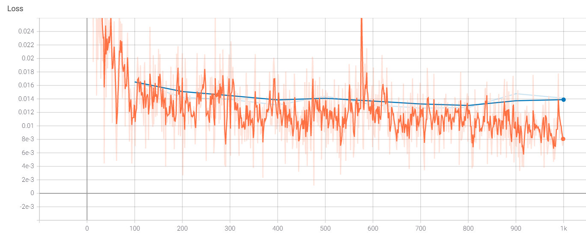

# Hippocampal Volume Quantification in Alzheimer’s Progression

Alzheimer's disease (AD) is a progressive neurodegenerative disorder that results in impaired neuronal (brain cell) function and eventually, cell death. AD is the most common cause of dementia. Clinically, it is characterized by memory loss, inability to learn new material, loss of language function, and other manifestations.

For patients exhibiting early symptoms, quantifying disease progression over time can help direct therapy and disease management.

A radiological study via MRI exam is currently one of the most advanced methods to quantify the disease. In particular, the measurement of hippocampal volume has proven useful to diagnose and track progression in several brain disorders, most notably in AD. Studies have shown a reduced volume of the hippocampus in patients with AD.

The hippocampus is a critical structure of the human brain (and the brain of other vertebrates) that plays important roles in the consolidation of information from short-term memory to long-term memory. In other words, the hippocampus is thought to be responsible for memory and learning 

Humans have two hippocampi, one in each hemisphere of the brain. They are located in the medial temporal lobe of the brain. Fun fact - the word "hippocampus" is roughly translated from Greek as "horselike" because of the similarity to a seahorse observed by one of the first anatomists to illustrate the structure, but you can also see the comparison in the following image.

According to Nobis et al., 2019, the volume of hippocampus varies in a population, depending on various parameters, within certain boundaries, and it is possible to identify a "normal" range taking into account age, sex and brain hemisphere.
You can see this in the image below where the right hippocampal volume of women across ages 52 - 71 is shown.

There is one problem with measuring the volume of the hippocampus using MRI scans, though - namely, the process tends to be quite tedious since every slice of the 3D volume needs to be analyzed, and the shape of the structure needs to be traced. The fact that the hippocampus has a non-uniform shape only makes it more challenging. 

As you might have guessed by now, we are going to build a piece of AI software that could help clinicians perform this task faster and more consistently.

In this project, we will focus on the technical aspects of building a segmentation model and integrating it into the clinician's workflow, leaving the dataset curation and model validation questions largely outside the scope of this project.

## Goal of the project

In this project you will build an end-to-end AI system which features a machine learning algorithm that integrates into a clinical-grade viewer and automatically measures hippocampal volumes of new patients, as their studies are committed to the clinical imaging archive.

Fortunately you won't have to deal with full heads of patients. Our (fictional) radiology department runs a HippoCrop tool which cuts out a rectangular portion of a brain scan from every image series, making your job a bit easier, and our committed radiologists have collected and annotated a dataset of relevant volumes, and even converted them to NIFTI format!

You will use the dataset that contains the segmentations of the right hippocampus and you will use the U-Net architecture to build the segmentation model.

After that, you will proceed to integrate the model into a working clinical PACS such that it runs on every incoming study and produces a report with volume measurements.

## The Dataset

We are using the "Hippocampus" dataset from the Medical Decathlon competition. This dataset is stored as a collection of NIFTI files, with one file per volume, and one file per corresponding segmentation mask. The original images here are T2 MRI scans of the full brain. As noted, in this dataset we are using cropped volumes where only the region around the hippocampus has been cut out. This makes the size of our dataset quite a bit smaller, our machine learning problem a bit simpler and allows us to have reasonable training times. You should not think of it as "toy" problem, though. Algorithms that crop rectangular regions of interest are quite common in medical imaging. Segmentation is still hard.

## The Programming Environment

If you would like to run the project locally, you would need a Python 3.7+ environment with the following libraries for the first two sections of the project:
* PyTorch (preferably with CUDA)
* nibabel
* matplotlib
* numpy
* pydicom
* Pillow (should be installed with pytorch)
* tensorboard
In the 3rd section of the project we will be working with three software products for emulating the clinical network. You would need to install and configure:
* Orthanc server for PACS emulation
* OHIF zero-footprint web viewer for viewing images. Note that if you deploy OHIF from its github repository, at the moment of writing the repo includes a yarn script (orthanc:up) where it downloads and runs the Orthanc server from a Docker container. If that works for you, you won't need to install Orthanc separately.
* If you are using Orthanc (or other DICOMWeb server), you will need to configure OHIF to read data from your server. OHIF has instructions for this: https://docs.ohif.org/configuring/data-source.html
* In order to fully emulate the Udacity workspace, you will also need to configure Orthanc for auto-routing of studies to automatically direct them to your AI algorithm. For this you will need to take the script that you can find at section3/src/deploy_scripts/route_dicoms.lua and install it to Orthanc as explained on this page: https://book.orthanc-server.com/users/lua.html
* DCMTK tools for testing and emulating a modality. Note that if you are running a Linux distribution, you might be able to install dcmtk directly from the package manager (e.g. apt-get install dcmtk in Ubuntu)

## Section 1: Curating a Dataset of Brain MRIs

In the project directory called section1 you can find
1. Curated dataset with labels, as collection of NIFTI files. Amount of training image volumes should be the same as the amount of label volumes.
2. A Python Notebook with the results of your Exploratory Data Analysis. 

A 3D visualization of the volume of hippocampus is demonstrated in the figure below

## Section 2: Training a segmentation CNN

In the directory called section2 you can find the source code that forms the framework for the machine learning pipeline.
For training the model PyTorch is used, and we will be using Tensorboard to visualize the results.
You will use the script run_ml_pipeline.py to kick off your training pipeline. 

The code has hooks to log progress to Tensorboard. In order to see the Tensorboard output you need to launch Tensorboard executable from the same directory where run_ml_pipeline.py is located using the following command:

> ‘tensorboard --logdir runs --bind_all’

After that, Tensorboard will write logs into directory called runs and you will be able to view progress by opening the browser and navigating to default port 6006 of the machine where you are running it.

The following files are provided:
1. Functional code that trains the segmentation model
2. Test report with Dice scores on test set (can be json file). Your final average Dice with the default model should be around .90
3. Screenshots from your Tensorboard (or other visualization engine) output, showing Train and Validation loss plots, along with images of the predictions that your model is making at different stages of training

## Section 3: Integrating into a Clinical Network

In this final section you will use some of the work you did for Section 2 to create an AI product that can be integrated into a clinical network and provide the auto-computed information on the hippocampal volume to the clinicians. While hospital integrations are typically handled by hospital IT staff, it will help tremendously if you can talk the same language with the people who will operate your model, and will have a feel for how clinical radiological software works. These skills will also help you debug your model in the field.

We have the following software in this setup:

* MRI scanner is represented by a script section3/deploy_scripts/send_volume.sh. When you run this script it will simulate what happens after a radiological exam is complete, and send a volume to the clinical PACS. Note that scanners typically send entire studies to archives. *PACS server is represented by Orthanc deployment that is listening to DICOM DIMSE requests on port 4242. Orthanc also has a DicomWeb interface that is exposed at port 8042, prefix /dicom-web. There is no authentication and you are welcome to explore either one of the mechanisms of access using a tool like curl or Postman. Our PACS server is also running an auto-routing module that sends a copy of everything it receives to an AI server. 
* Viewer system is represented by OHIF. It is connecting to the Orthanc server using DicomWeb and is serving a web application on port 3000. 
* AI server is represented by a couple of scripts. section3/deploy_scripts/start_listener.sh brings up a DCMTK's storescp and configures it to just copy everything it receives into a directory that you will need to specify by editing this script, organizing studies as one folder per study. HippoVolume.AI is the AI module that you will create in this section.

> ‘inference_dcm.py’ is the file that you will be working on. It contains code that will analyze the directory of the AI server that contains the routed studies, find the right series to run your algorithm on, will generate report, and push it back to our PACS.

Note that in real system you would architect things a bit differently. Probably, AI server would be a separate piece of software that would monitor the output of the listener, and would manage multiple AI modules, deciding which one to run, automatically. In our case, for the sake of simplicity, all code sits in one Python script that you would have to run manually after you simulate an exam via the send_volume.sh script -inference_dcm.py. It combines the functions of processing of the listener output and executing the model, and it does not do any proper error handling :)

Note, that the DICOM studies used for inferencing this section have been created artificially, and while full-brain series belong to the same original study, this is not the study from which the hippocampus crop is taken.

The following are provided:
1. Code that runs inference on a DICOM volume and produces a DICOM report
2. A report.dcm file with a sample report
3. Validation Plan, which can be found in the description below

## Steps to run simulation

Before starting to work on the tasks in this workspace you should launch Orthanc and OHIF and here are the steps:
1. Open a terminal and enter the following:
> ‘bash launch_orthanc.sh’ 
or 
> ‘./launch_orthanc.sh’
Don't close this terminal
2. Wait for it to complete, with the last line being something like
W0509 05:38:21.152402 main.cpp:719] Orthanc has started and/or you can verify that Orthanc is working by running echoscu 127.0.0.1 4242 -v in a new terminal.
3. Open a new terminal and enter the following
> ‘bash launch_OHIF.sh’ 
or 
> ‘./launch_OHIF.sh’
Don't close this terminal
4. Wait for it to complete, with the last line being something like
@ohif/viewer: ? ?wdm?: Compiled with warnings.
* OHIF should automatically open in a Chromium Web Browser but if not you can paste localhost:3005 into the address bar of a Chromium Window.
* orthanc isn't necessary to open but if you need it you can access it can paste localhost:8042 into the address bar of a Chromium Window.

After the above steps, to run the clinical application simulation:

1. copy model weights file from section2/<specific_run_directory>/model.path to directory section3/

2. Open new terminal window and start AI server by entering into terminal (the following commands have to be executed from directory deplay_scripts):
> curl -X POST http://localhost:8042/tools/execute-script --data-binary @route_dicoms.lua -v

> storescp 106 -v -aet HIPPOAI -od /home/workspace/src/routed/ --sort-on-study-uid st

3. Open new terminal window and simulate an exam by entering command:
> storescu 127.0.0.1 4242 -v -aec HIPPOAI +r +sd /data/TestVolumes/Study1

4. run the inference_dcm.py from src directory to create the report report.dcm:
> python inference_dcm.py new/

## Validation plan
* What is the intended use of the product? *
An automatic estimation of the volume of hippocampus from MRI scans of patients that may have AD.
* How was the training data collected? *
We are using the "Hippocampus" dataset from the Medical Decathlon competition. This dataset is stored as a collection of NIFTI files, with one file per volume, and one file per corresponding segmentation mask. The original images here are T2 MRI scans of the full brain. As noted, in this dataset we are using cropped volumes where only the region around the hippocampus has been cut out.
* How did you label your training data? *
Radiologists labeled data as belonging to 1) background, 2) posterior and 3) anterior hippocampus structures
* How was the training performance of the algorithm measured and how is the real-world performance going to be estimated? *
Performance is measured mainly based on Dice coefficient. Other measures can also be used (Jaccard coefficient also implemented). Radiologists need to check the results of the AI segmentation to see how accurate they are. To make sure that the algorithm is learning during training, we checked the training and validation loss. 
* What data will the algorithm perform well in the real world and what data it might not perform well on? *
It is expected that the algorithm will perform well in data that have a similar distribution to those used during training (volume range from ~2300 to ~4400) and not well if data have different distributions (outside of this volume range). It is also important to feed only a cropped image of the are around hippocampus and not whole brain scans.

